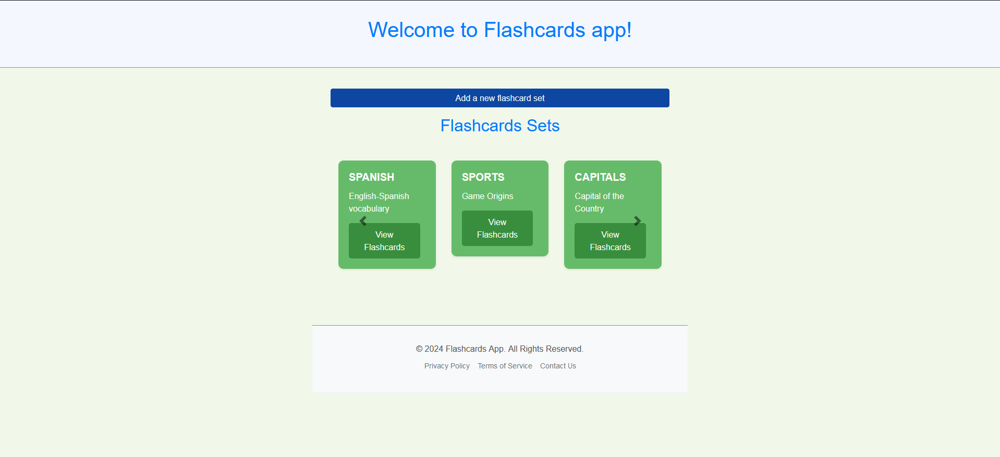
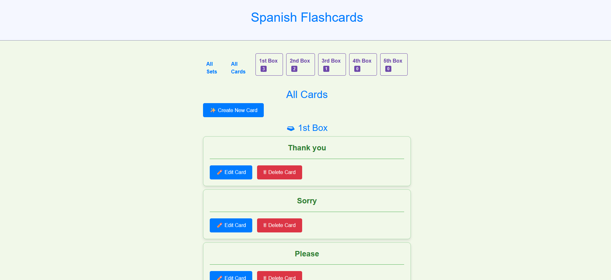

# Flashcard App

## Table of Contents
- [Introduction](#introduction)
- [Features](#features)
- [Prerequisites](#prerequisites)
- [Installation](#installation)
- [Usage](#usage)
- [Contributing](#contributing)
- [License](#license)
- [Contact](#contact)

## Introduction
The **Flashcard App** is a powerful and user-friendly application designed to help you create, manage, and review flashcards. Whether you're studying for exams, learning a new language, or retaining important information, this app is your perfect companion.



## Features
- **Create and Manage Flashcard Sets:** Easily create multiple sets for different subjects.
- **Add, Edit, and Delete Flashcards:** Full control over your flashcards.
- **Study in Random or Sequential Order:** Flexible study modes to suit your needs.
- **Track Progress:** Monitor your performance and identify areas for improvement.
- **Responsive Design:** User-friendly interface that works on all devices.



## Prerequisites
Before you begin, ensure you have met the following requirements:
- [Python](https://www.python.org/downloads/) (version 3.6 or later)
- [Django](https://www.djangoproject.com/) (version 3.0 or later)

## Installation
To install and set up the Flashcard App, follow these steps:

1. Clone the repository:
    ```bash
    git clone https://github.com/SKarthi97/flashcards-app.git
    ```

2. Navigate to the project directory:
    ```bash
    cd flashcards-app
    ```

3. Create a virtual environment:
    ```bash
    python3 -m venv env
    ```

4. Activate the virtual environment:
    - On Windows:
        ```bash
        .\env\Scripts\activate
        ```
    - On macOS and Linux:
        ```bash
        source env/bin/activate
        ```

5. Install the required dependencies:
    ```bash
    pip install -r requirements.txt
    ```

6. Apply the database migrations:
    ```bash
    python flashcards_app/manage.py migrate
    ```

7. Create a superuser account to access the admin interface:
    ```bash
    python flashcards_app/manage.py createsuperuser
    ```

8. Start the development server:
    ```bash
    python flashcards_app/manage.py runserver
    ```

9. Open your browser and go to `http://127.0.0.1:8000` to access the app.

## Usage
1. **Create Flashcard Sets:** Log in to the admin interface at `http://127.0.0.1:8000/admin` and create flashcard sets.
2. **Add Flashcards:** Within each set, add individual flashcards with a question and answer.
3. **Study Flashcards:** Navigate to the main interface and select a set to start reviewing your flashcards.
4. **Track Progress:** Use the built-in tracking features to monitor your progress and identify areas for improvement.

## Contributing
Contributions are welcome! If you'd like to contribute, please follow these steps:
1. Fork the repository.
2. Create a new branch (`git checkout -b feature-branch`).
3. Make your changes and commit them (`git commit -m 'Add some feature'`).
4. Push to the branch (`git push origin feature-branch`).
5. Create a new Pull Request.

## License
This project is licensed under the MIT License - see the [LICENSE](LICENSE) file for details.

## Contact
For any questions or suggestions, please contact:
- Your Name - [Karthick Sivakumar](mailto:karthicksivakumar97@gmail.com)
- Project Link: [https://github.com/SKarthi97/flashcards-app](https://github.com/SKarthi97/flashcards-app)

---

Enhance your learning with the **Flashcard App**! Happy Studying!